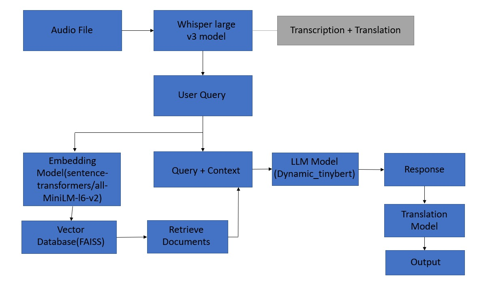

# RAG LLM Application with Whisper Integration

This project implements a Retrieval-Augmented Generation (RAG) application using the Whisper Large V3 model for pre-processing and a large language model for retrieving and answering questions.

## Workflow

 

### Audio Pre-processing:

1. Process audio files with Whisper Large V3 for automatic speech recognition (ASR).
2. Extract transcribed text from Whisper output.

### Text Translation:

- Translate transcribed text into English using Whisper largev3.

### Text Processing:

- Use translated text (depending on workflow) as a user prompt for RAG.

### RAG Integration:

- RAG retrieves relevant documents from its database based on the prompt.
- A large language model (LLM) answers the user's question using retrieved documents.

## Implementation Steps

### 1. Clone the Repository:

Clone the GitHub repository to your local machine:

### 2. Install Dependencies:

Install required dependencies using pip:

### 3. Run Whisper Pre-processing:

Execute the following command to run the `whisper.py` file, which saves the Whisper model in a `saved_model` directory:

### 4. Run Transcription and Translation:

Run the `transcribe_translation.py` file to transcribe and optionally translate audio files. The translated text will be stored in a text file:

## 5.vector database

There is a need of databases so that we can store those embeddings and efficiently search them. Therefore, for storage and searching purpose, we need vector stores. You can retrieve the embedding vectors which will be “most similar”. Basically, it does a vector search for you. There are many vector stores integrated with LangChain, but I have used here “FAISS” vector store.

### 5. Run RAG LLM Model:

Use the generated text from the previous step to input questions to the RAG LLM model. This model will provide responses based on the retrieved documents.

to do that run rag.ipynb notebook.

### 6.convert the response into desired language

using the translation model facebook/seamless-m4t-v2-large at end we can get our final output in our language.

